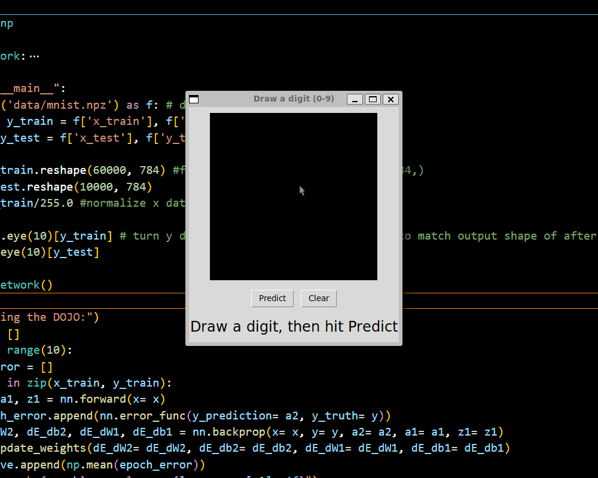

# Neural Network from Scratch

A feedforward neural network implemented in NumPy, with the forward pass,
backpropagation, and training loop written from first principles. No deep
learning frameworks and no automatic differentiation. It classifies MNIST
handwritten digits at **96.9% test accuracy**.

NumPy is used for array arithmetic only; every component of the network is
derived and implemented by hand. The objective was to verify each piece
directly rather than rely on a framework.



## Architecture

```
input (784) → hidden (64, ReLU) → output (10, softmax)
```

- Input: 28×28 images flattened to 784 values, normalized to [0, 1]
- Hidden layer: 64 units, ReLU activation
- Output: 10 classes, softmax
- Loss: cross-entropy
- Optimizer: stochastic gradient descent
- Initialization: He initialization

## Backpropagation

The gradients were derived by hand and verified against finite-difference
numerical estimates (`verify_gradient.py`). Analytical and numerical gradients
agree to within ~1e-11:

```
W1: 6.8e-13     b1: 1.6e-11
W2: 1.4e-11     b2: 3.3e-11
```

## Results

Over 10 epochs the average loss decreases steadily, reaching 96.9% accuracy on
the held-out test set:

```
epoch 0:  loss = 0.2265
epoch 9:  loss = 0.0267
test accuracy: 96.88%  (9688 / 10000)
```

## Demo

`demo.py` opens a canvas for drawing a digit with the mouse; the trained network
classifies it in real time.

Input is centered by its center of mass before inference, matching the centered,
size-normalized format of the MNIST training data. The model generalizes well
within MNIST's distribution, so this step closes the domain gap to freehand input.

## Usage

Run the demo with the included pre-trained weights:

```bash
pip install -r requirements.txt
python demo.py
```

Train a model from scratch (downloads MNIST first):

```bash
mkdir -p data
wget https://storage.googleapis.com/tensorflow/tf-keras-datasets/mnist.npz -O data/mnist.npz
python neural_network.py
```

Training prints per-epoch loss and final test accuracy, and saves the weights to
`trained_model.npz`.

## Files

| File | Description |
|------|-------------|
| `neural_network.py` | Network, training loop, and evaluation |
| `verify_gradient.py` | Numerical gradient check |
| `demo.py` | Interactive drawing demo |
| `trained_model.npz` | Pre-trained weights |